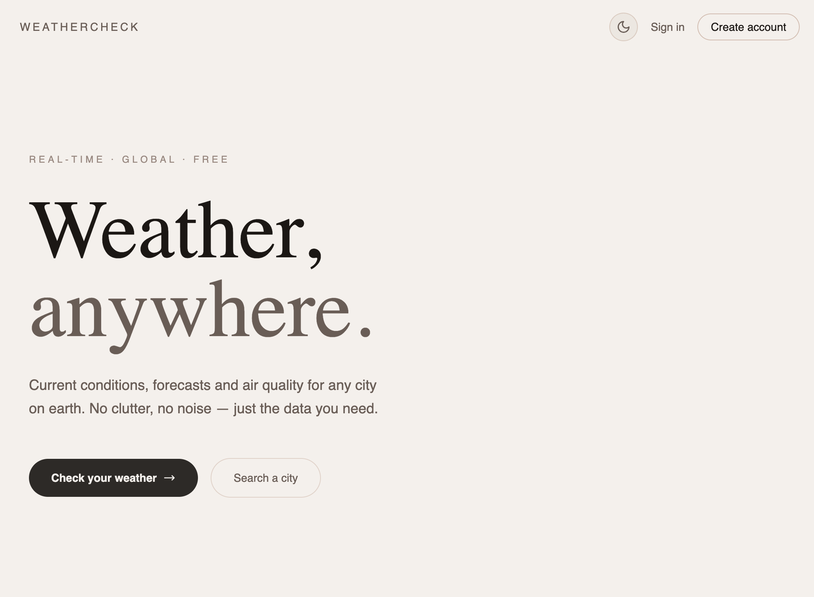
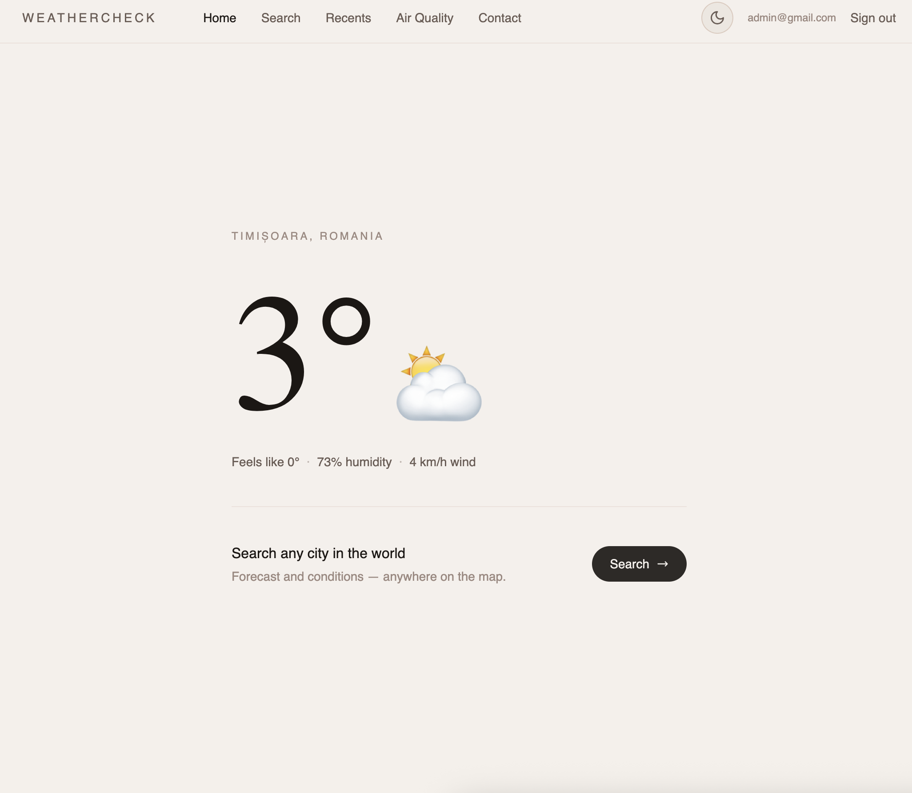
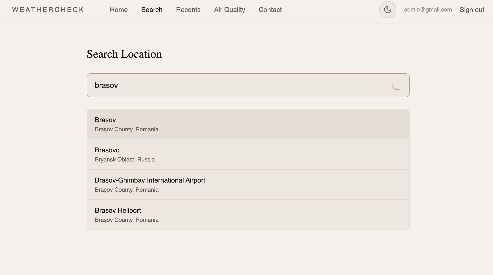
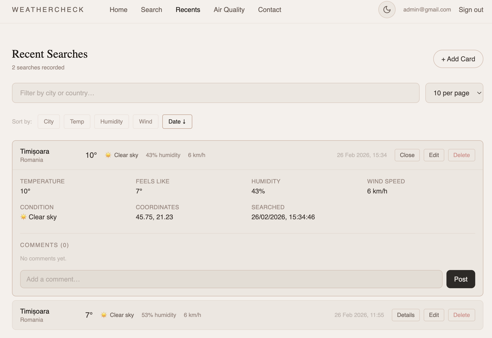
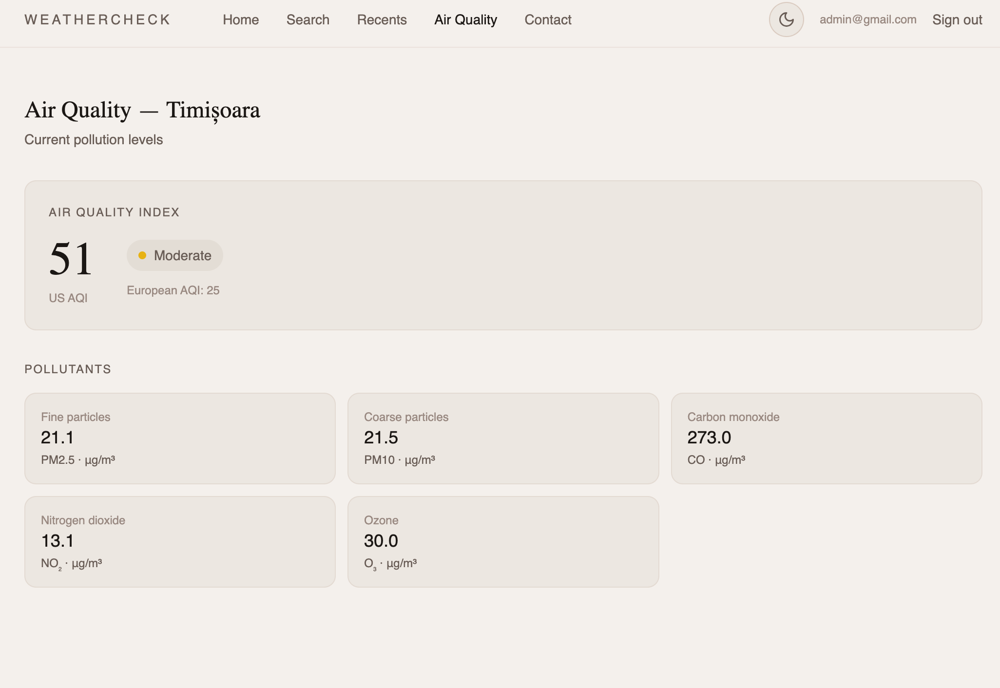
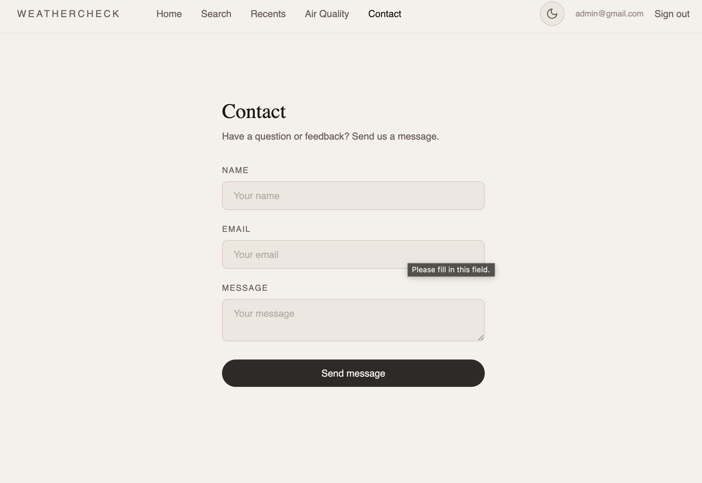
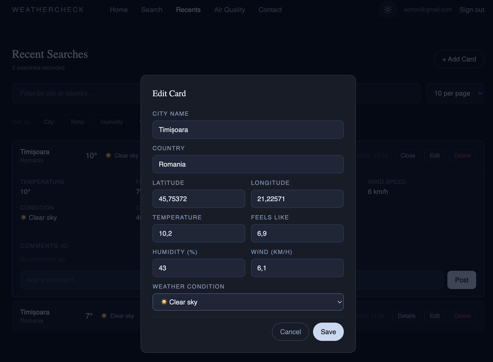

# Razvan Balan - Weather Check

## Functionalitati implementate
- Auth(visitor/admin) cu supabase
- responsive layout
- tabel recente(sort, filter, paginare)
- redux(state slice for auth, weather, ui, recents)
- creare/editare/stergere items de catre admin
- recents si ui preferences in localstorage

## Landing page

## Home

## Search 

## Recents

## Air quality

## Contact

## Dark mode

